# Project Report 4: Reinforcement Learning

__*Train a Smartcab How to Drive*__

## Metrics

The simulator code was modified to report the following metrics for each execution of each Agent that was analyzed:

* __N dest reached__ - Total number of trials in which the agent arrived to the destination. Arriving to the destination is the
 main objective of the agent. The bigger this value, the better.
* __Last dest failure__ - Last trial in which the agent failed to arrive at the destination. An agent that is learning is expected
 to fail early in the learning process but to arrive all the time after it has learned enough. The lowest this value, the earlier
 the agent learnt.
* __Last penalty__ - Last trial in which the agent was penalized. An agent that is learning is expected
 to be penalized early in the learning process but to drive without recieving penalties after it has learned to drive.
 The lowest this value, the earlier the agent learnt.
* __Length Q table__ - Size of the Q table (for agents that use Q-learning). Each time an agent visits a state and selects a new
 action for this state a new entry in the Q table will be inserted. The bigger this value, the more the agent explored the state
  space during the learning process.

## Implement a basic driving agent

To implement a basic driving agent a random action from `(None, 'forward', 'left', 'right')` was chosen on each call to the update method.
This causes the agent to wander (randomly) around the grid until eventually the deadline is reached or the agent arrives, by chance, to the target.

100 runs of 100 trials were executed for these agent with the following results:

|          | __N dest reached__ | __Last dest fail__ | __Last penalty__ | __Len Q  table__ |
| -------- |-------------------:|-------------------:|-----------------:|-----------------:|
|__mean__  |        20.090000   |        99.840000   |          100.0   |             0.0  |
|__std__   |         3.348737   |         0.465366   |            0.0   |             0.0  |
|__min__   |        13.000000   |        97.000000   |          100.0   |             0.0  |
|__25%__   |        18.000000   |       100.000000   |          100.0   |             0.0  |
|__50%__   |        20.000000   |       100.000000   |          100.0   |             0.0  |
|__75%__   |        22.000000   |       100.000000   |          100.0   |             0.0  |
|__max__   |        30.000000   |       100.000000   |          100.0   |             0.0  |

The agent was able to arrive to the destination 20% of the time on average while being penalized in every trial.

Another 100 runs where executed without enforcing the deadline to see if a random agent can reach the destination before the hard limit (deadline of -100).
The results are the following:

|          | __N dest reached__ | __Last dest fail__ | __Last penalty__ | __Len Q  table__ |
| -------- |-------------------:|-------------------:|-----------------:|-----------------:|
|__mean__  |       67.220000    |        97.640000   |          100.0   |             0.0  |
|__std__   |        4.757939    |         2.649643   |            0.0   |             0.0  |
|__min__   |       57.000000    |        87.000000   |          100.0   |             0.0  |
|__25%__   |       64.000000    |        96.000000   |          100.0   |             0.0  |
|__50%__   |       67.000000    |        99.000000   |          100.0   |             0.0  |
|__75%__   |       70.000000    |       100.000000   |          100.0   |             0.0  |
|__max__   |       81.000000    |       100.000000   |          100.0   |             0.0  |

The basic (random) driving agent arrives to the target before the hard limit, on average,
67.2% of the time and 20.1% of the time when the deadline is enforced while being penalized
all the time.

An example of the number of penalties per trial is shown below. If the agent was learning to drive the amount of penalties would be smaller at the
last trials which is not the case with this agent.

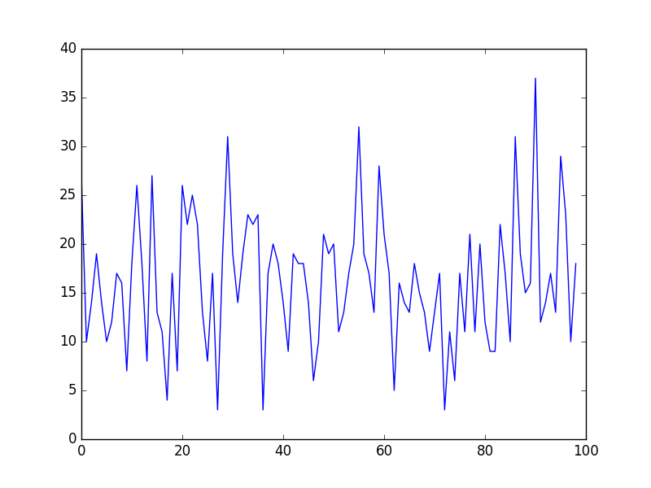

## Identify and update state

From the project description we know that:

* The smartcab has only an egocentric view of the intersection it is at: It can determine the state of the traffic light for its direction of movement,
 and whether there is a vehicle at the intersection for each of the oncoming directions.
* For each action, the smartcab may either idle at the intersection, or drive to the next intersection to the left, right, or ahead of it.
* Each trip has a time to reach the destination which decreases for each action taken (the passengers want to get there quickly). If the allotted time
 becomes zero before reaching the destination, the trip has failed.
* The smartcab gets a reward for each successfully completed trip (gets to the target within a pre-specified time bound).
* It also gets a smaller reward for each correct move executed at an intersection.
* It gets a small penalty for an incorrect move.
* It gets a larger penalty for violating traffic rules and/or causing an accident.

The correct moves at each intersection are calculated using the US right-of-way rules:

* On a green light, you can turn left only if there is no oncoming traffic at the
 intersection coming straight.
* On a red light, you can turn right if there is no oncoming traffic turning left
 or traffic from the left going straight.

The following information is available for the agent at each update:

* __Light__: whether the light is red or green (2 states). Going through an intersection with a red light is a traffic rule violation, so I consider this
 information important and it needs to be part of the state.
* __Oncoming__: whether there is oncoming traffic, and which direction it is going (4 states). Oncoming traffic may mean the agent cannot turn left or
 right, so this information needs to be in the state as well.
* __Right__: whether there is traffic from the right of the agent, and which direction it is going (4 states).
 Traffic coming from the right is not mentioned in any of the traffic rules defined in the description of the project so it may not be important
 for the agent to figure out if it can turn left or right, although it may be important to avoid accidents with other agents if they are not
 following correctly traffic rules or if different rules for right-of-way are applied.
* __Left__: whether there is traffic from the left of the agent, and which direction it is going (4 states).
 Traffic from the left going straight means the agent cannot turn right on a red light, so this needs to be in the state. It may, however, be reduced to the single
 case of left going straight (2 states).
* __Next waypoint__: the direction the agent should go to reach the destination (3 states).
 Without this information, the agent does not have a way to know where the target is and what is the next step in the computed route plan so
 it will have to wander randomnly, For this reason I consider this information important and it needs to be in the state.
* __Deadline__: how much time the agent has left to reach its destination (50 states for the current simulation).
 This value depends on the distance to the target. As the agent only knows what is the next step in the planned route and does not know the
 position of the final destination, it does not know how far it is or how to get faster. So knowing how much time is left is basically useless.

I decided to test different agents using different combinations of the inputs as part of the state. The following agents, with the specified state rules, were executed
 and its results recorded.

### Only input without waypoint or deadline

The following states are considered in this model:

* Light (2 states)
* Oncoming (4 states)
* Right (4 states)
* Left (4 states)

This produces a space of possible states of size 128 (2 x 4 x 4 x 4). The size of the state is reasonable but the agent is missing information
 about the objective and I suspect that it will not be able to arrive to the destination.

### Input and waypoint without deadline

The following states are considered in this model:

* Light (2 states)
* Oncoming (4 states)
* Right (4 states)
* Left (4 states)
* Next Waypoint (3 states)

This produces a space of possible states of size 384 (2 x 4 x 4 x 4 x 3). The size of the state is big but still reasonable.
 It contains all the information needed to make an informed decision in all possible cases if the deadline is reasonable. For each
 execution the agent visits at most 100(trials)x50(max deadline)=5,000 states, so each state can be visited at most 13 times,
 which is not enough but possibly good enough if there are enough combinations of states and actions that are not worth visiting more than once.

### Input with waypoint and deadline

The following states are considered in this model:

* Light (2 states)
* Oncoming (4 states)
* Right (4 states)
* Left (4 states)
* Next Waypoint (3 states)
* Deadline (50 states)

This produces a space of possible states of size 19,200 (2 x 4 x 4 x 4 x 3 x 50).
The size of this state is huge. For each execution the agent visits at most 100(trials)x50(max deadline)=5,000 states, so each
state is visited at most 0.2 times, which is definitly not enough.

### Input and waypoint without deadline nor right state

The following states are considered in this model:

* Light (2 states)
* Oncoming (4 states)
* Left (4 states)
* Next Waypoint (3 states)

This produces a space of possible states of size 96 (2 x 4 x 4 x 3). For each execution the agent visits at most 100(trials)x50(max deadline)=5,000 states, so each
state is visited at most 52 times which looks good enough specially if there are enough combinations of states and actions that are not worth visiting more than once.

### Input and waypoint without deadline nor right state and reduced left state

The following states are considered in this model:

* Light (2 states)
* Oncoming (4 states)
* Incomming_Left (2 states)
* Next Waypoint (3 states)

This produces a space of possible states of size 48 (2 x 4 x 2 x 3). This is the smallest possible state that contains all the information
to take an informed desition with the current rules. For each execution the agent visits at most 100(trials)x50(max deadline)=5,000 states, so each
state is visited at most 104 times which looks good enough specially if there are enough combinations of states and actions that are not worth
visiting more than once.

The last two space definitions have the problem of being specialized for the current setup of the learning problem and could have problems
 generalizing if different rules are applied.

## Implement Q-Learning

Q-learning is an algorithm in which an agent tries to learn the optimal policy from its history of interaction with the environment.
 The general formula of the Q-learning equation is the following:

<!--- Q(s,a)= R(s) + \gamma \sum_{s'} T(s,a,s') \max\limits_{a'} Q(s', a')  -->

Q-learning estimates `Q` using the transitions `<s,a,r,s'>`, where `a` is an action, `s` is a state, `r` is the reward obtained
 after executing the action `a` and `s'` is the new state after executing action `a`, by maintaining a table `Q[S,A]`, where `S`
 is the set of states and `A` is the set of actions. `Q[s,a]` represents its current estimate of `Q*(s,a)`.

`Q*(s,a)` can be seen as the expected value (cumulative discounted reward) of doing `a` in state `s` and then following the optimal policy.

<!-- \hat{Q}_{t}(s,a) \overset{\alpha} \longleftarrow  r + \gamma \max\limits_{a'} \hat{Q}_{t - 1}(s', a')   -->

An agent that learns using Q-learning was implemented and executed using the 5 different states defined in the previous section.
For each agent, the Q-learning parameters `alpha` and `gamma` were fixed in the value `0.1`.
 Each agent tested showed big differences against the random agent. For start, all of them have values in their Q tables,
which, if the Q-learning algorithm was implemented correctly, means that they are learning from each state they visit.

Each agent, except for the agent that does not include the waypoint in its state which keeps moving in an random-like pattern,
begins moving randomly and after a few updates starts heading to the target. Also, the agents are being penalized less and less on each consecutive trial.
This indicates that the agents are learning to drive to the objective following the rules using the Q-learning algorithm.

Results for each agent are shown below.

### Only input without waypoint or deadline

|          | __N dest reached__ | __Last dest fail__ | __Last penalty__ | __Len Q  table__ |
| -------- |-------------------:|-------------------:|-----------------:|-----------------:|
|__mean__  |       0.700000     |       100.0        |      97.350000   |     56.840000    |
|__std__   |       1.193416     |         0.0        |       3.026399   |      5.058686    |
|__min__   |       0.000000     |       100.0        |      84.000000   |     44.000000    |
|__25%__   |       0.000000     |       100.0        |      96.000000   |     54.000000    |
|__50%__   |       0.000000     |       100.0        |      98.000000   |     57.000000    |
|__75%__   |       1.000000     |       100.0        |     100.000000   |     60.000000    |
|__max__   |       9.000000     |       100.0        |     100.000000   |     69.000000    |

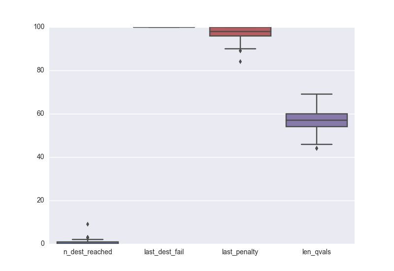

This agent only arrives at the destination, on average, 7% of the time making it worse than the random agent. From the sizes of the Q table
 it is possible to see that it is learning but it is missing information about the world to be able to arrive to an informed decision.

An example of the number of penalties per trial is shown below. It is worth noting that the agent, although it does not know in which direction
the objective is, is able to learn the driving rules and reduce its penalties before half of the trials.

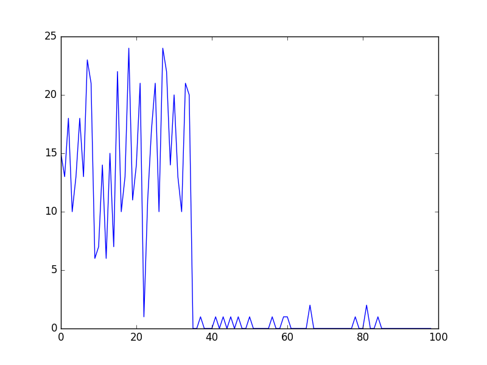

### Input and waypoint without deadline

|          | __N dest reached__ | __Last dest fail__ | __Last penalty__ | __Len Q  table__ |
| -------- |-------------------:|-------------------:|-----------------:|-----------------:|
|__mean__  |      98.960000     |    22.870000       |     93.960000    |    66.520000     |
|__std__   |       0.920255     |    31.824536       |      5.908255    |     7.257848     |
|__min__   |      97.000000     |    -1.000000       |     66.000000    |    47.000000     |
|__25%__   |      98.000000     |    -1.000000       |     92.000000    |    62.000000     |
|__50%__   |      99.000000     |     2.000000       |     96.000000    |    66.000000     |
|__75%__   |     100.000000     |    39.750000       |     98.000000    |    71.250000     |
|__max__   |     100.000000     |    96.000000       |    100.000000    |    86.000000     |

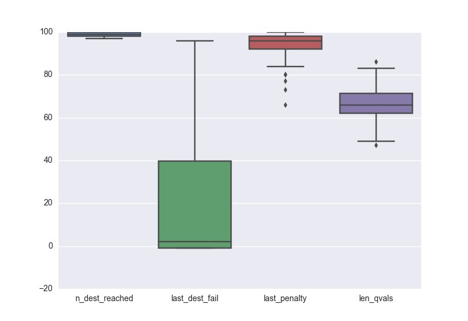

This agent does not reach the destination in at most 3 cases with the last destination failure around the 22nd trial and without penalties
in the last 6 trials. This means that this agent is learning to follow the directions and learning the driving rules, but 100 trails are just
enough to do it.

An example of the number of penalties per trial is shown below. There is a sharp decrease of penalties per trial after the first two or three and
some penalties scatered around the whole execution. This means that the agent learnt really fast to achive positive feedback by driving in the
direction of the objective but it is encountering unknown states later in the execution.

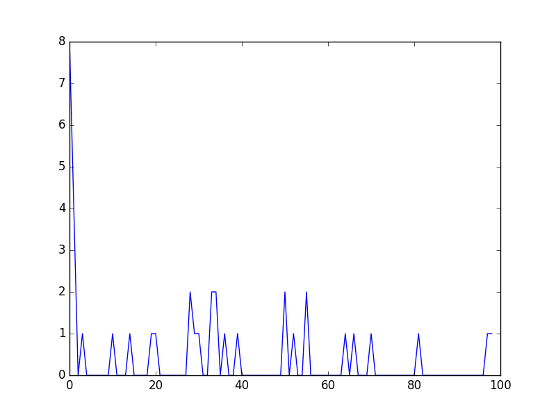

### Input with waypoint and deadline

|          | __N dest reached__ | __Last dest fail__ | __Last penalty__ | __Len Q  table__ |
| -------- |-------------------:|-------------------:|-----------------:|-----------------:|
|__mean__  |       83.01000      |     73.180000     |      98.870000   |    767.350000    |
|__std__   |        2.78341      |     18.437106     |       1.501884   |     40.548107    |
|__min__   |       76.00000      |     26.000000     |      93.000000   |    655.000000    |
|__25%__   |       81.00000      |     61.750000     |      98.000000   |    743.750000    |
|__50%__   |       83.00000      |     76.500000     |      99.000000   |    760.000000    |
|__75%__   |       85.00000      |     88.250000     |     100.000000   |    791.250000    |
|__max__   |       89.00000      |    100.000000     |     100.000000   |    870.000000    |

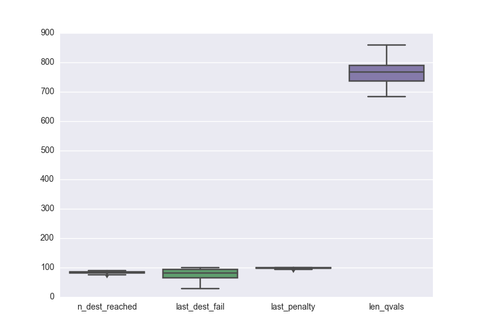

This agent reaches the destination 83% of the time with the last destination failure around the 73rd trial (on average) and receiving penalties
even in the last trial more than 25% of the time. This means that this agent is learning but 100 trials are still not enough to be sure that the
agent has generalized correctly the rules. From the size of the Q table we can see that the amount of states visited is beetween 500 and 1000
which means that agent is far from visiting all possible states (19,200) and it is behaving randomly a lot of the time.

An example of the number of penalties per trial is shown below. It is possible to see a slight decreasing trend in the amount of penalties per
trial which means the agent is slowly learning but not fast enough.

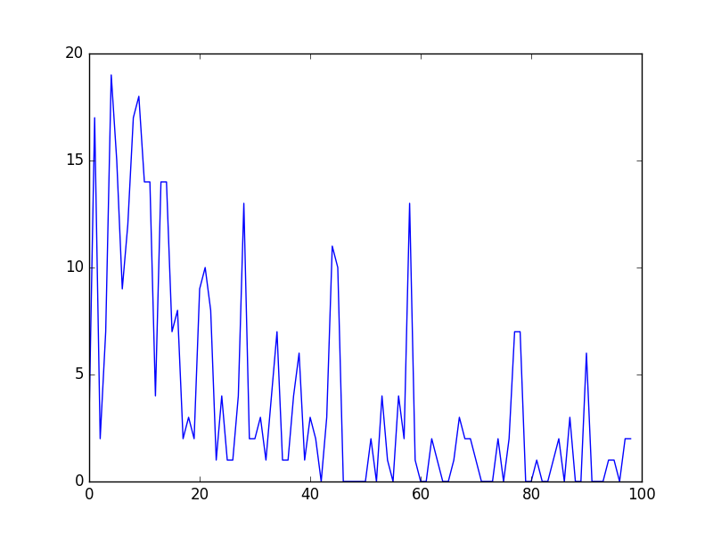

### Input and waypoint without deadline nor right state

|          | __N dest reached__ | __Last dest fail__ | __Last penalty__ | __Len Q  table__ |
| -------- |-------------------:|-------------------:|-----------------:|-----------------:|
|__mean__  |      99.330000     |    14.540000       |     91.650000    |    48.870000     |
|__std__   |       0.779212     |    27.821371       |      8.391163    |     5.387331     |
|__min__   |      97.000000     |    -1.000000       |     51.000000    |    36.000000     |
|__25%__   |      99.000000     |    -1.000000       |     86.750000    |    45.000000     |
|__50%__   |      99.000000     |     1.000000       |     94.000000    |    49.000000     |
|__75%__   |     100.000000     |     9.000000       |     98.000000    |    52.000000     |
|__max__   |     100.000000     |    96.000000       |    100.000000    |    62.000000     |

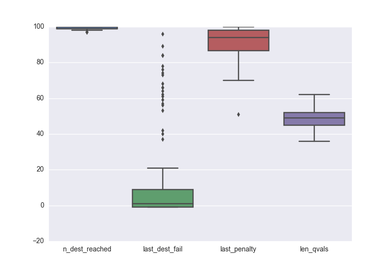

This agent does not reach the destination (on average) in at most 3 cases with the last destination failure around the 15th trial and without penalties
in the last 8 trials. This means that this agent is learning to follow the directions and learning the driving rules faster than the
previous agent, but 100 trails are still just enough to do it.

An example of the number of penalties per trial is shown below. It is possible to see that the agent is not penalized most of the time
after the first 5 trials.

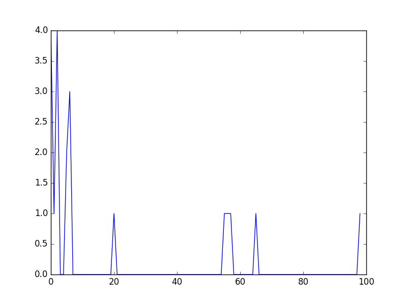

### Input and waypoint without deadline nor right state and reduced left state

|          | __N dest reached__ | __Last dest fail__ | __Last penalty__ | __Len Q  table__ |
| -------- |-------------------:|-------------------:|-----------------:|-----------------:|
|__mean__  |      99.320000     |     11.980000      |     88.600000    |    41.410000     |
|__std__   |       0.679869     |     25.121515      |     10.818054    |     5.346754     |
|__min__   |      98.000000     |     -1.000000      |     50.000000    |    28.000000     |
|__25%__   |      99.000000     |     -1.000000      |     85.000000    |    37.750000     |
|__50%__   |      99.000000     |      1.000000      |     92.000000    |    41.000000     |
|__75%__   |     100.000000     |     14.000000      |     97.000000    |    45.000000     |
|__max__   |     100.000000     |     98.000000      |    100.000000    |    57.000000     |

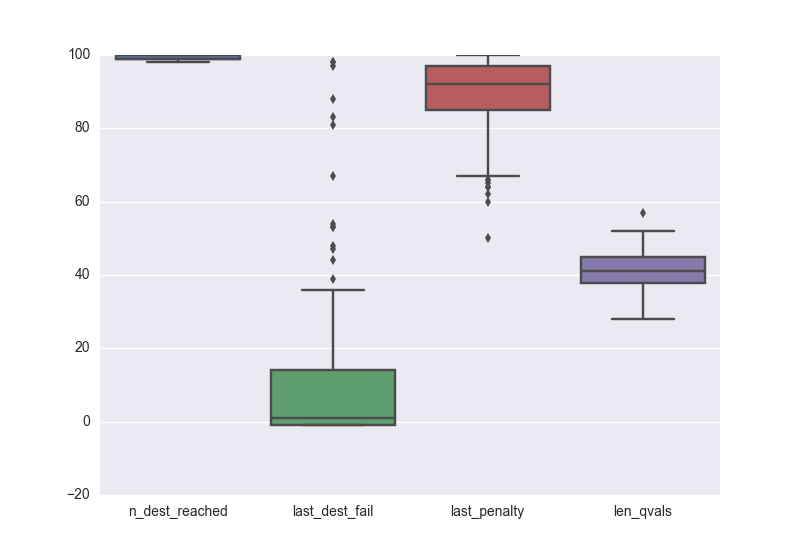

This agent does not reach the destination in at most 2 cases with more than 25% of the runs arriving 100% of the time,
the last destination failure is in the first 2 trial in more than 50% of the time and is executed without penalties in
the last 8 trials. This means that this agent is learning to follow the directions and learning the driving rules faster
than the previous agent.

An example of the number of penalties per trial is shown below. It is possible to see that, like the previous agent,
the agent is not penalized most of the time after the first 2 (instead of 5) trials.

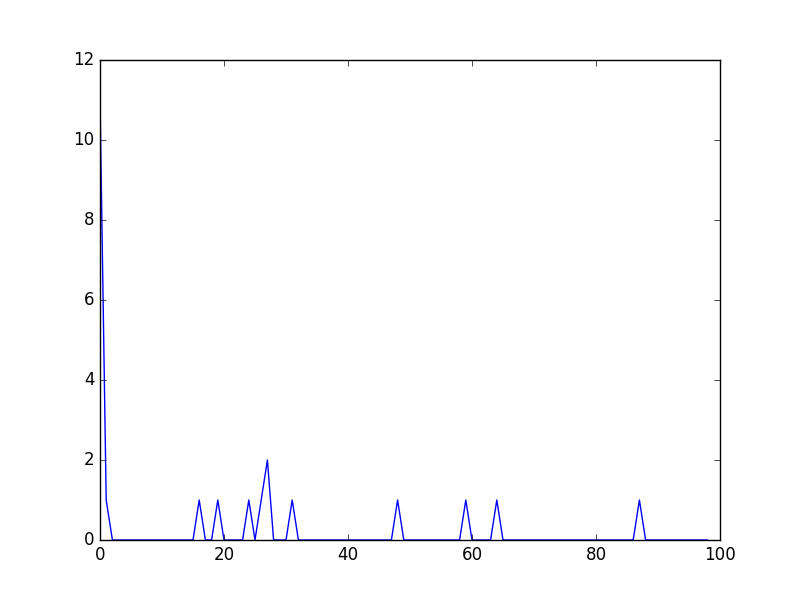

## Enhance the driving agent

Based on the results from the executions of all agents, I decided to keep only the 2nd agent. The agent that uses the inputs and
the waypoint as part of its state but leaves the deadline out of it.

It is easy to see that the the agents that do not include the waypoint or include the deadline as part of the state are not being
able to learn fast enough or learn at all how to drive to the objective. So this agents were not optimized.

The agents that does not include the Right and have a reduce Left state are learning faster than the selected agent but they
are being overfitted to the current rules by artificially reducing the input state. These agents will learn faster in this setting
but will fail to learn to drive correctly in a different scenario, like driving in London.

The parameters in the Q-Learning algorithm, such as the learning rate (`alpha`), the discount factor (`gamma`) and the exploration rate (`epsilon`)
all contribute to the driving agent’s ability to learn the best action for each state.
This is why, for the selected agent, a series of experiments were run varying the values of the parameters `alpha`, `gamma` between 0 and 1 inclusive
and `epsilon` between 0 and 0.2 inclusive. Each interval was divided in 10 parts. For each experiment 100 executions of 100 trials were run
and the values for the metrics described in the first section of this report were saved.

The values from all experiments is shown below:

|          | __N dest reached__ | __Last dest fail__ | __Last penalty__ | __Len Q  table__ |
| -------- |-------------------:|-------------------:|-----------------:|-----------------:|
|__count__ |   133100.000000    |   133100.000000    |  133100.000000   |  133100.000000   |
|__mean__  |       79.800015    |       80.821946    |      99.384373   |      78.941142   |
|__std__   |       25.197432    |       28.364969    |       1.770683   |      14.146824   |
|__min__   |        1.000000    |       -1.000000    |      62.000000   |      36.000000   |
|__25%__   |       78.000000    |       77.000000    |     100.000000   |      70.000000   |
|__50%__   |       91.000000    |       94.000000    |     100.000000   |      77.000000   |
|__75%__   |       96.000000    |       99.000000    |     100.000000   |      85.000000   |
|__max__   |      100.000000    |      100.000000    |     100.000000   |     142.000000   |

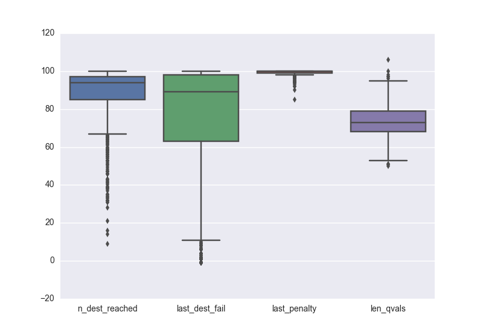

It is worth noting that the max size of the Q table is 142 and, because the Q table contains the explored (state, action) pairs,
this means that at most 142 of the 384 possible states * 4 possible actions were visited (around 1%). 

The top 10 results of the executions when sorted first by the __Last Penalty__ and
then by the __Last Destination Failed__ are the following:

| __alpha__ | __gamma__ | __epsilon__ | __N dest reached__ | __Last dest fail__ | __Last penalty__ | __Len Q  table__ |
| --------- | ---------:| -----------:| ------------------:|-------------------:|-----------------:|-----------------:| 
|   0.7     |    0.2    |     0.0     |           99       |          7         |        62        |       59         |
|   0.2     |    0.0    |     0.0     |          100       |         -1         |        63        |       59         |
|   0.3     |    0.1    |     0.0     |          100       |         -1         |        63        |       49         |
|   0.6     |    0.0    |     0.0     |           98       |         31         |        63        |       59         |
|   0.8     |    0.0    |     0.0     |          100       |         -1         |        64        |       65         |
|   1.0     |    0.7    |     0.0     |           99       |         19         |        66        |       43         |
|   0.3     |    0.2    |     0.0     |          100       |         -1         |        67        |       47         |
|   0.4     |    0.0    |     0.0     |           99       |         66         |        68        |       68         |
|   0.9     |    0.1    |     0.0     |           99       |         14         |        70        |       61         |
|   0.4     |    0.3    |     0.0     |           99       |          1         |        71        |       58         |

These results are impresive because the agent is reaching the destination on at least 99% of the cases and the last time it fails
to reach the destination is below 20 in most cases while visiting only around 50 states (0.5% of all possible states). But, in order to
select the best combination of parameters, the result obtained by executing the agent with those parameters not only have to be good in
one case, but have to be consistenly good. This is why the results for all the executions of the agent with each set of parameters were
grouped and then sorted by the average and the standard deviation for each of the metrics.

The results are the following:

### Sorted by _n dest reached_

| __alpha__ | __gamma__ | __epsilon__ | __LDF mean__ | __LDF std__ | __NDR mean__ | __NDR std__  | __LP mean__ | __LP std__  |
| --------- | ---------:| -----------:| --------:|---------:|---------:|---------:|---------:|--------:|---------:|--------:|     
|  0.3  |  0.0   |   0.0   |    25.12 |  34.851860  |  99.05 |  0.925235   |    94.15 |  5.313172  | 
|  0.1  |  0.0   |   0.0   |    19.69 |  31.230875  |  99.03 |  1.067944   |    94.87 |  5.435861  | 
|  0.9  |  0.0   |   0.0   |    21.74 |  31.285140  |  99.02 |  0.942595   |    94.70 |  5.194208  | 
|  0.9  |  0.1   |   0.0   |    18.22 |  27.142564  |  99.00 |  0.828775   |    94.92 |  5.631226  | 
|  0.7  |  0.1   |   0.0   |    22.72 |  31.847833  |  99.00 |  0.921132   |    95.40 |  4.754583  | 
|  0.4  |  0.1   |   0.0   |    22.29 |  32.208066  |  98.98 |  0.963789   |    95.04 |  5.443781  | 
|  0.5  |  0.0   |   0.0   |    18.83 |  27.613880  |  98.98 |  0.994734   |    94.67 |  5.175808  | 
|  1.0  |  0.0   |   0.0   |    20.84 |  32.094154  |  98.97 |  1.009600   |    94.37 |  5.839010  | 
|  0.6  |  0.0   |   0.0   |    25.13 |  34.143978  |  98.96 |  1.043692   |    95.24 |  5.576140  | 
|  0.3  |  0.1   |   0.0   |    24.59 |  34.389949  |  98.95 |  0.978300   |    93.69 |  6.147505  | 

### Sorted by _Last penalty_

| __alpha__ | __gamma__ | __epsilon__ | __LDF mean__ | __LDF std__ | __NDR mean__ | __NDR std__  | __LP mean__ | __LP std__  |
| --------- | ---------:| -----------:| --------:|---------:|---------:|---------:|---------:|--------:|---------:|--------:|     
|  0.3 |  0.1   |   0.0   |  24.59 |  34.389949  |  98.95 |  0.978300   |    93.69 |  6.147505  | 
|  0.3 |  0.0   |   0.0   |  25.12 |  34.851860  |  99.05 |  0.925235   |    94.15 |  5.313172  | 
|  0.8 |  0.0   |   0.0   |  29.76 |  36.081871  |  98.88 |  0.956424   |    94.34 |  5.817459  | 
|  0.6 |  0.1   |   0.0   |  25.10 |  32.410717  |  98.94 |  0.982884   |    94.37 |  5.704251  | 
|  1.0 |  0.0   |   0.0   |  20.84 |  32.094154  |  98.97 |  1.009600   |    94.37 |  5.839010  | 
|  0.7 |  0.0   |   0.0   |  21.34 |  29.328243  |  98.95 |  1.057680   |    94.38 |  5.890894  | 
|  0.2 |  0.1   |   0.0   |  27.01 |  33.603600  |  98.91 |  0.995901   |    94.41 |  5.756147  | 
|  0.4 |  0.0   |   0.0   |  29.18 |  33.566873  |  98.89 |  0.973331   |    94.43 |  6.289730  | 
|  0.2 |  0.0   |   0.0   |  26.96 |  34.685578  |  98.83 |  0.985296   |    94.55 |  6.067591  | 
|  0.5 |  0.0   |   0.0   |  18.83 |  27.613880  |  98.98 |  0.994734   |    94.67 |  5.175808  | 

### Sorted by _Last dest fail_

| __alpha__ | __gamma__ | __epsilon__ | __LDF mean__ | __LDF std__ | __NDR mean__ | __NDR std__  | __LP mean__ | __LP std__  |
| --------- | ---------:| -----------:| --------:|---------:|---------:|---------:|---------:|--------:|---------:|--------:|     
|  0.9 |  0.1   |   0.0   |  18.22 |  27.142564  |  99.00 |  0.828775   |   94.92  |  5.631226  | 
|  0.5 |  0.0   |   0.0   |  18.83 |  27.613880  |  98.98 |  0.994734   |   94.67  |  5.175808  | 
|  0.1 |  0.0   |   0.0   |  19.69 |  31.230875  |  99.03 |  1.067944   |   94.87  |  5.435861  | 
|  1.0 |  0.0   |   0.0   |  20.84 |  32.094154  |  98.97 |  1.009600   |   94.37  |  5.839010  | 
|  0.7 |  0.0   |   0.0   |  21.34 |  29.328243  |  98.95 |  1.057680   |   94.38  |  5.890894  | 
|  0.9 |  0.0   |   0.0   |  21.74 |  31.285140  |  99.02 |  0.942595   |   94.70  |  5.194208  | 
|  0.4 |  0.1   |   0.0   |  22.29 |  32.208066  |  98.98 |  0.963789   |   95.04  |  5.443781  | 
|  0.7 |  0.1   |   0.0   |  22.72 |  31.847833  |  99.00 |  0.921132   |   95.40  |  4.754583  | 
|  0.3 |  0.1   |   0.0   |  24.59 |  34.389949  |  98.95 |  0.978300   |   93.69  |  6.147505  | 
|  0.6 |  0.1   |   0.0   |  25.10 |  32.410717  |  98.94 |  0.982884   |   94.37  |  5.704251  | 

0.3   0.1     0.0 is part of the top 10 for all cases.
0.5  0 0
1 0 0 
 
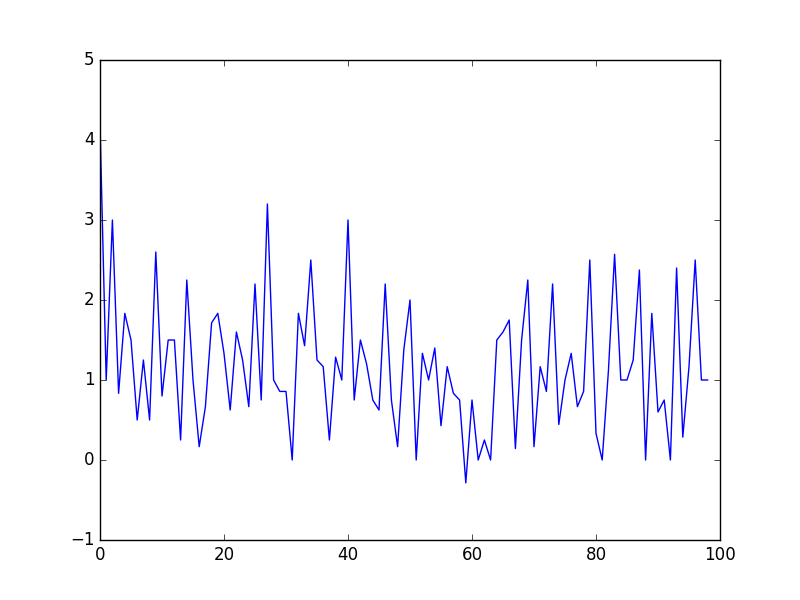

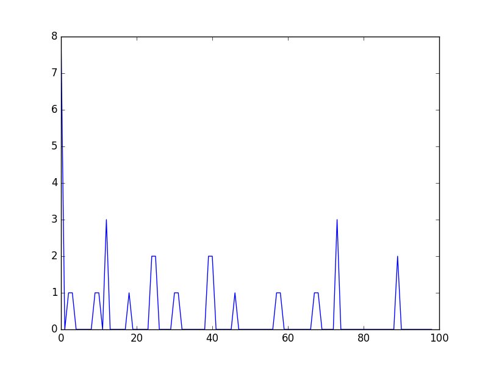

_QUESTION: Report the different values for the parameters tuned in your basic implementation of Q-Learning. For which set of parameters does the agent perform best? How well does the final driving agent perform?_

_QUESTION: Does your agent get close to finding an optimal policy, i.e. reach the destination in the minimum possible time, and not incur any penalties? How would you describe an optimal policy for this problem?_

