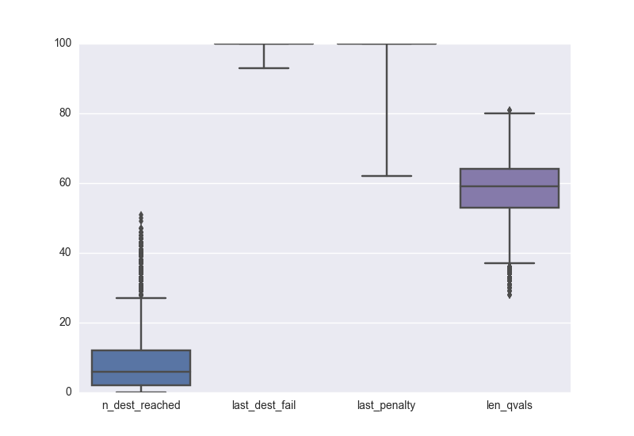

# Project Report 4: Reinforcement Learning

__*Train a Smartcab How to Drive*__

## Metrics

The simulator code was modified to report the following metrics for each execution of each Agent that was analyzed:

* __N dest reached__ - Total number of trials in which the agent arrived to the destination. Arriving to the destination is the
 main objective of the agent. The bigger this value, the better.
* __Last dest failure__ - Last trial in which the agent failed to arrive at the destination. An agent that is learning is expected
 to fail early in the learning process but arrive all the time after it has learned enough. The lowest this value, the earlier
 the agent learnt.
* __Last penalty__ - Last trial in which the agent was penalized. An agent that is learning is expected
 to be penalized early in the learning process but drive without recieving penalties after it has learned to drive.
 The lowest this value, the earlier the agent learnt.
* __Length Q table__ - Size of the Q table (for agents that use Q-learning). Each time an agent visits a state and selects a new
 action for this state a new entry in the Q table will be inserted. The bigger this value, the more the agent explored the state
  space during the learning process.

## Implement a basic driving agent

To implement a basic driving agent a random action from `(None, 'forward', 'left', 'right')` was chosen on each call to the update method.
This causes the agent to wander (randomly) around the grid until eventually the deadline is reached or the agent arrives, by chance, to the target.

100 runs of 100 trials were executed for these agent with the following results:

|          | __N dest reached__ | __Last dest fail__ | __Last penalty__ | __Len Q  table__ |
| -------- |-------------------:|-------------------:|-----------------:|-----------------:|
|__mean__  |        20.090000   |        99.840000   |          100.0   |             0.0  |
|__std__   |         3.348737   |         0.465366   |            0.0   |             0.0  |
|__min__   |        13.000000   |        97.000000   |          100.0   |             0.0  |
|__25%__   |        18.000000   |       100.000000   |          100.0   |             0.0  |
|__50%__   |        20.000000   |       100.000000   |          100.0   |             0.0  |
|__75%__   |        22.000000   |       100.000000   |          100.0   |             0.0  |
|__max__   |        30.000000   |       100.000000   |          100.0   |             0.0  |

The agent was able to arrive to the destination 20% of the time on average while being penalized in every trial.

Another 100 runs where executed without enforcing the deadline to see if a random agent can reach the destination before the hard limit
or the hard limit (deadline of -100).
The results are the following:

|          | __N dest reached__ | __Last dest fail__ | __Last penalty__ | __Len Q  table__ |
| -------- |-------------------:|-------------------:|-----------------:|-----------------:|
|__mean__  |       67.220000    |        97.640000   |          100.0   |             0.0  |
|__std__   |        4.757939    |         2.649643   |            0.0   |             0.0  |
|__min__   |       57.000000    |        87.000000   |          100.0   |             0.0  |
|__25%__   |       64.000000    |        96.000000   |          100.0   |             0.0  |
|__50%__   |       67.000000    |        99.000000   |          100.0   |             0.0  |
|__75%__   |       70.000000    |       100.000000   |          100.0   |             0.0  |
|__max__   |       81.000000    |       100.000000   |          100.0   |             0.0  |

The basic (random) driving agent arrives to the target before the hard limit, on average,
67.2% of the time and 20.1% of the time when the deadline is enforced while being penalized
all the time.

## Identify and update state

From the project description we know that:

* The smartcab has only an egocentric view of the intersection it is at: It can determine the state of the traffic light for its direction of movement,
 and whether there is a vehicle at the intersection for each of the oncoming directions.
* For each action, the smartcab may either idle at the intersection, or drive to the next intersection to the left, right, or ahead of it.
* Each trip has a time to reach the destination which decreases for each action taken (the passengers want to get there quickly). If the allotted time
 becomes zero before reaching the destination, the trip has failed.
* The smartcab gets a reward for each successfully completed trip (gets to the target within a pre-specified time bound).
* It also gets a smaller reward for each correct move executed at an intersection.
* It gets a small penalty for an incorrect move.
* It gets a larger penalty for violating traffic rules and/or causing an accident.

The correct moves at each intersection are calculated using the US right-of-way rules:

* On a green light, you can turn left only if there is no oncoming traffic at the
 intersection coming straight.
* On a red light, you can turn right if there is no oncoming traffic turning left
 or traffic from the left going straight.

The following information is available for the agent at each update:

* __Light__: whether the light is red or green (2 states). Going through an intersection with a red light is a traffic rule violation, so I consider this
 information important and it needs to be part of the state.
* __Oncoming__: whether there is oncoming traffic, and which direction it is going (4 states). Oncoming traffic may mean the agent cannot turn left or
 right, so this information needs to be in the state as well.
* __Right__: whether there is traffic from the right of the agent, and which direction it is going (4 states).
 Traffic coming from the right is not mentioned in any of the traffic rules defined in the description of the project so it may not be important
 for the agent to figure out if it can turn left or right, although it may be important to avoid accidents with other agents if they are not
 following correctly traffic rules or if different rules for right-of-way are applied.
* __Left__: whether there is traffic from the left of the agent, and which direction it is going (4 states).
 Traffic from the left going straight means the agent cannot turn right on a red light, so this needs to be in the state. It may, however, be reduced to the single
 case of left going straight (2 states).
* __Next waypoint__: the direction the agent should go to reach the destination (3 states).
 Without this information, the agent does not have a way to know where the target is and what is the next step in the computed route plan so
 it will have to wander randomnly, For this reason I consider this information important and it needs to be in the state.
* __Deadline__: how much time the agent has left to reach its destination (50 states for the current simulation).
 This value depends on the distance to the target. As the agent only knows what is the next step in the planned route and does not know the
 position of the final destination, it does not know how far it is or how to get faster. So knowing how much time is left is basically useless.

I decided to test different agents using different combinations of the inputs as part of the state. The follwoing agents, with the specified state rules, were executed
 and its results recorded.

### Only input without waypoint or deadline

The following states are considered in this model:

* Light (2 states)
* Oncoming (4 states)
* Right (4 states)
* Left (4 states)

This produces a space of possible states of size 128 (2 x 4 x 4 x 4). The size of the state is reasonable but the agent is missing information
 about the objective and I suspect that it will not be able to arrive to the destination.

### Input and waypoint without deadline

The following states are considered in this model:

* Light (2 states)
* Oncoming (4 states)
* Right (4 states)
* Left (4 states)
* 8 Next Waypoint (3 states)

This produces a space of possible states of size 384 (2 x 4 x 4 x 4 x 3). The size of the state is big but still reasonable.
 For each state, there are 4 possible actions to be taken so the model needs at least 1,536 steps to visit at least once each state.
 It contains all the information needed to make an informed decision in all possible cases if the deadline is reasonable. For each
 execution the agent visits at most 100(trials)x50(max deadline)=5,000 states, so each state can be visited at most 3.2 times,
 which is not enough but possibly good enough if there are enough combinations of states and actions that are not worth visiting more than once.

### Input with waypoint and deadline

The following states are considered in this model:

* Light (2 states)
* Oncoming (4 states)
* Right (4 states)
* Left (4 states)
* Next Waypoint (3 states)
* Deadline (50 states)

This produces a space of possible states of size 19,200 (2 x 4 x 4 x 4 x 3 x 50).
The size of this state is huge. For each state, there are 4 possible actions to be taken so the model needs at least
76,800 steps to visit at least once each state. For each execution the agent visits at most 100(trials)x50(max deadline)=5,000 states, so each
state is visited at most 0.5 times, which is definitly not enough.

### Input and waypoint without deadline nor right state

The following states are considered in this model:

* Light (2 states)
* Oncoming (4 states)
* Left (4 states)
* Next Waypoint (3 states)

This produces a space of possible states of size 96 (2 x 4 x 4 x 3). For each state, there are 4 possible actions to be taken so the model needs at least
384 steps to visit at least once each state. For each execution the agent visits at most 100(trials)x50(max deadline)=5,000 states, so each
state is visited at most 13 times which looks good enough specially if there are enough combinations of states and actions that are not worth visiting more than once.

### Input and waypoint without deadline nor right state and reduced left state

The following states are considered in this model:

* Light (2 states)
* Oncoming (4 states)
* Incomming_Left (2 states)
* Next Waypoint (3 states)

This produces a space of possible states of size 48 (2 x 4 x 2 x 3). This is the smallest possible state pace that contains all the information
to take an informed desition with the current rules. For each state, there are 4 possible actions to be taken so the model needs at least
192 steps to visit at least once each state. For each execution the agent visits at most 100(trials)x50(max deadline)=5,000 states, so each
state is visited at most 26 times which looks good enough specially if there are enough combinations of states and actions that are not worth
visiting more than once.

The last two space definitions have the problem of being specielized for the current setup of the learning problem and could have problems
 generalizing if different rules are applied.

## Implement Q-Learning

_QUESTION: What changes do you notice in the agent's behavior when compared to the basic driving agent when random actions were always taken? Why is this behavior occurring?_

### Only input without waypoint or deadline

|          | __N dest reached__ | __Last dest fail__ | __Last penalty__ | __Len Q  table__ |
| -------- |-------------------:|-------------------:|-----------------:|-----------------:|
|__mean__  |        8.11281     |        99.899985   |      99.628445   |     58.108437    |
|__std__   |        7.15024     |         0.383102   |       1.397704   |      7.385131    |
|__min__   |        0.00000     |        93.000000   |      62.000000   |     28.000000    |
|__25%__   |        2.00000     |       100.000000   |     100.000000   |     53.000000    |
|__50%__   |        6.00000     |       100.000000   |     100.000000   |     59.000000    |
|__75%__   |       12.00000     |       100.000000   |     100.000000   |     64.000000    |
|__max__   |       51.00000     |       100.000000   |     100.000000   |     81.000000    |

This agent only arrives at the destination 8% of the time making it worse than the random agent. From the size of the Q table
 it is possible to see that it is learning but it is missing information about the world to be able to arrive to an informed
 desition.

### Input with waypoint and deadline

## Enhance the driving agent

_QUESTION: Report the different values for the parameters tuned in your basic implementation of Q-Learning. For which set of parameters does the agent perform best? How well does the final driving agent perform?_

_QUESTION: Does your agent get close to finding an optimal policy, i.e. reach the destination in the minimum possible time, and not incur any penalties? How would you describe an optimal policy for this problem?_

Parameters in the Q-Learning algorithm, such as the learning rate (alpha), the discount factor (gamma) and the exploration rate (epsilon) all contribute to the driving agent’s ability to learn the best action for each state.